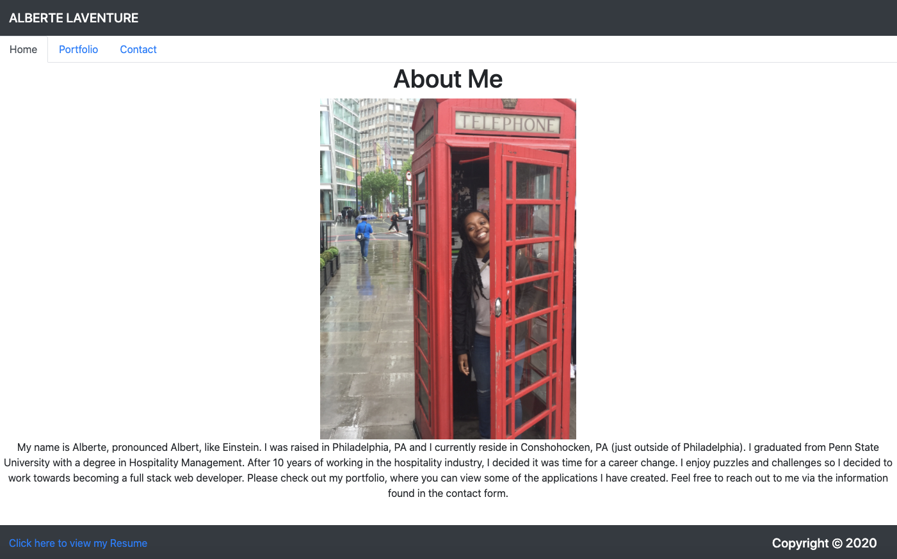

# ReactPortfolio
## Description
I have created a portfolio for interested parties to view some of my work. It contains an About Me page, Portfolio of Projects, and a Contact Form. My Resume is also linked in the footer.

Deployed link: https://dry-wildwood-09043.herokuapp.com/

## Technologies used
``` React.js, HTML, CSS, JSX, JavaScript```

## License
[](https://opensource.org/licenses/MIT)
